#   Devops-Tooling-Website-Solution
Our team is set to adopt a suite of DevOps tools designed to streamline and enhance our daily operations across development, testing, deployment, and monitoring of various projects. The selected tools are industry standards, embraced by numerous DevOps teams worldwide. Here's an outline of the DevOps Tooling Solution we will integrate:

1. Jenkins
Jenkins is a robust, free, and open-source automation server that facilitates the creation of continuous integration and continuous delivery (CI/CD) pipelines.

2. Kubernetes
Kubernetes is a cutting-edge, open-source container orchestration system that simplifies the deployment, scaling, and management of application containers.

3. JFrog Artifactory
JFrog Artifactory serves as a Universal Repository Manager that supports all the major packaging formats, build tools, and CI servers.

4. Rancher
Rancher is an innovative open-source software platform that allows organizations to efficiently run and manage Docker and Kubernetes in a production environment.

5. Grafana
Grafana is a versatile, open-source analytics and interactive visualization web application that works across multiple platforms.

6. Prometheus
Prometheus offers an open-source monitoring solution, featuring a dimensional data model, a flexible query language, an efficient time series database, and a modern alerting approach.

7. Kibana
Kibana is a user-friendly, free, and open interface that enables you to visualize your Elasticsearch data and manage the Elastic Stack effectively.


As a member of a DevOps team, you will implement a tooling website solution which makes access to DevOps tools within the corporate infrastructure easily accessible.
In this project you will implement a solution that consists of following components:


1.Infrastructure: AWS
2.Webserver Linux: Red Hat Enterprise Linux 8
3.Database Server: Ubuntu 20.04 + MySQL
4.Storage Server: Red Hat Enterprise Linux 8 + NFS Server
5.Programming Language: PHP
6.Code Repository:GitHub


On the diagram below you can see a common pattern where several stateless Web Servers share a common database andalso access the same fi les using
Network File Sytem (NFS)
as a shared fi le storage. Even though the NFS server might belocated on a completely separate hardware - for Web Servers it look like a local file system from where they can serve the same files.

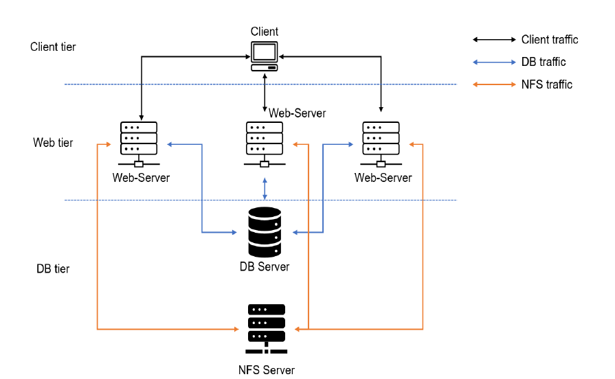


To implement a business website using NFS (Network File System) for the backend file storage with an EC2 instance on AWS, follow these steps:

### Step 1 - Prepare NFS Server
####    Launch EC2 Instance:
*   Log into the AWS Management Console.
*   Launch a new EC2 instance, selecting Red Hat Enterprise Linux 8 as the Operating System.

####    Configure LVM (Logical Volume Manager):
*   Connect to your instance via SSH.
*   Install the LVM package if it's not already installed.
*   Prepare your physical volumes (PVs) using the pvcreate command on the disks you want to include in your LVM.
*   Create a volume group (VG) with the vgcreate command.
*   Create logical volumes (LVs) with the lvcreate command. You'll create three logical volumes as specified:
    *   lv-apps
    *   lv-logs
    *   lv-opt

####    Format and Mount Logical Volumes:
*   Instead of using ext4, you will format your logical volumes using the mkfs.xfs command to create an XFS file system.
*   Once formatted, create directories for your mount points:
    *   /mnt/apps
    *   /mnt/logs
    *   /mnt/opt
*   Mount your logical volumes to these directories using the mount command.
*   To ensure they remain mounted after a reboot, add them to the /etc/fstab file.


Use lsblk command to inspect what block devices are attached to the server. Notice names of your newly created devices. All devices in Linux reside in /dev/ directory. Inspect it with ls /dev/ and make sure you see all 3 newly created block devices there - their names will likely be xvdf, xvdh, xvdg.

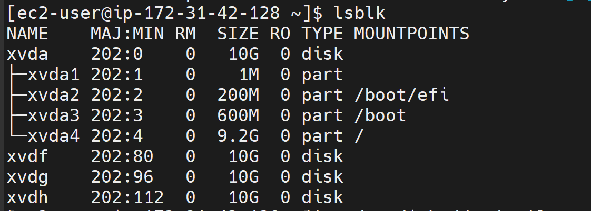

Use df -h command to see all mounts and free space on your server

Use gdisk utility to create a single partition on each of the 3 disks
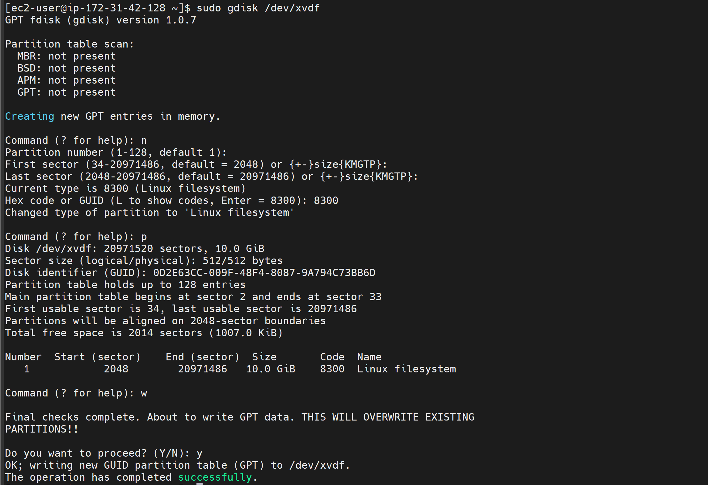

Do same for xvdg and xvdh

Use lsblk utility to view the newly configured partition on each of the 3 disks. the result should show as below

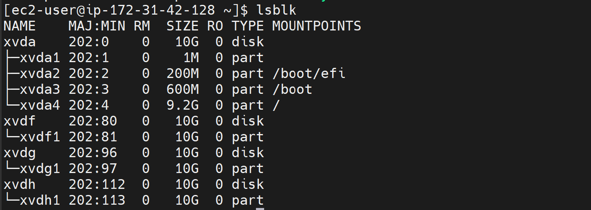

Install lvm2 package using sudo yum install lvm2. Run sudo lvmdiskscan command to check for available partitions.

```bash
sudo lvmdiskscan
```
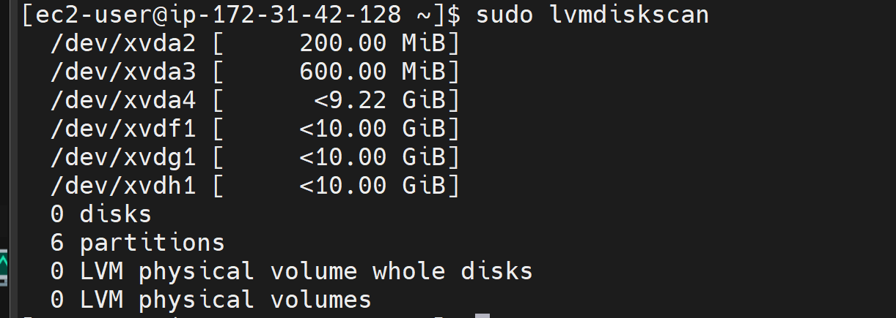

Use pvcreate utility to mark each of 3 disks as physical volumes (PVs) to be used by LVM
sudo pvcreate /dev/xvdf1
sudo pvcreate /dev/xvdg1
sudo pvcreate /dev/xvdh1

Verify that your Physical volume has been created successfully by running
```markdown
sudo pvs

```

Use vgcreate utility to add all 3 PVs to a volume group (VG). Name the VG webdata-vg

```markdown
sudo vgcreate webdata-vg /dev/xvdh1 /dev/xvdg1 /dev/xvdf1
```
Verify that your VG has been created successfully by running 
```bash
sudo vgs
```

Use lvcreate utility to create 3 logical volumes.  lv-opt,lv-apps, and lv-logs

```bash
sudo lvcreate -n lv-opt -L 9G webdata-vg
sudo lvcreate -n lv-apps -L 9G webdata-vg
sudo lvcreate -n lv-logs -L 9G webdata-vg
```
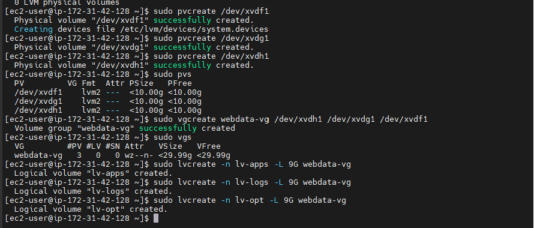

Running sudo lvs and lsblk t confirm work done
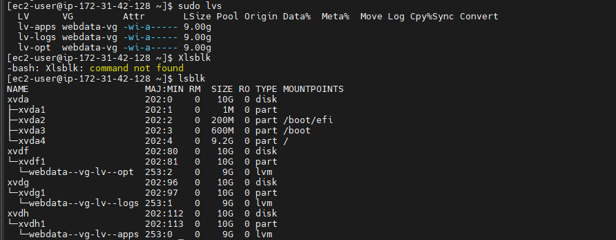

Use mkfs.xfs to format the logical volumes with xfs filesystem

```bash
sudo mkfs -t xfs /dev/webdata-vg/lv-opt
sudo mkfs -t xfs /dev/webdata-vg/lv-apps
sudo mkfs -t xfs /dev/webdata-vg/lv-logs
```

Create /mnt/apps directory to store app files

```markdown
sudo mkdir -p /mnt/apps
```

Create /mnt/apps directory to store log files

```markdown
sudo mkdir -p /mnt/logs
```

Create /mnt/opt directory to store opt files

```markdown
sudo mkdir -p /mnt/opt
```

Mount /mnt/apps and /mnt/logs on app,opt and logs logical volume

```markdown
sudo mount /dev/webdata-vg/lv-apps /mnt/apps
sudo mount /dev/webdata-vg/lv-logs /mnt/logs
sudo mount /dev/webdata-vg/lv-opt /mnt/opt
```
Update /etc/fstab file so that the mount configuration will persist after restart of the server.
The UUID of the device will be used to update the /etc/fstab file;

```markdown
sudo blkid
```
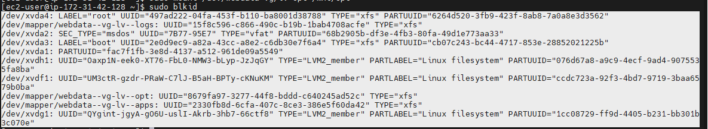

sudo vi /etc/fstab Update /etc/fstab in this format using your own UUID and rememeber to remove the leading and ending quotes.

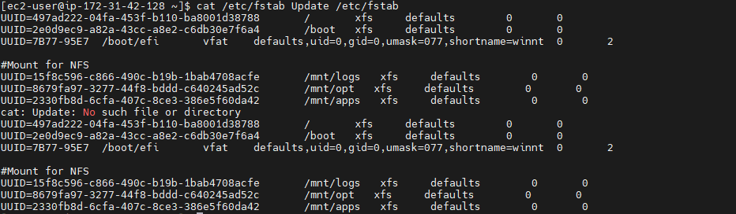

Test the configuration and reload the daemon

```markdown
sudo mount -a
sudo systemctl daemon-reload
```


Make sure we set up permission that will allow our Web servers to read, write and execute files on NFS:

```bash
sudo chown -R nobody: /mnt/apps
sudo chown -R nobody: /mnt/logs
sudo chown -R nobody: /mnt/opt

sudo chmod -R 777 /mnt/apps
sudo chmod -R 777 /mnt/logs
sudo chmod -R 777 /mnt/opt

sudo systemctl restart nfs-server.service
```
Configure access to NFS for clients within the same subnet (example of Subnet CIDR -172.31.32.0/20):

```bash
sudo vi /etc/exports

/mnt/apps <Subnet-CIDR>(rw,sync,no_all_squash,no_root_squash)
/mnt/logs <Subnet-CIDR>(rw,sync,no_all_squash,no_root_squash)
/mnt/opt <Subnet-CIDR>(rw,sync,no_all_squash,no_root_squash)

Esc + :wq!

sudo exportfs -arv
```
Check which port is used by NFS and open it using Security Groups (add new Inbound Rule)

```markdown
rpcinfo -p | grep nfs
```

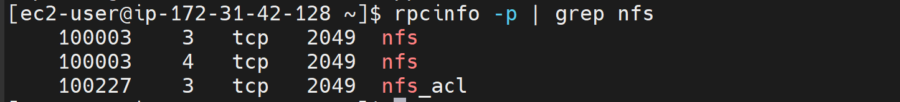

### Step 2 - Configure NFS
####    Install NFS Server:

Use the yum command to install the NFS server package.

```bash
sudo yum -y update
sudo yum install nfs-utils -y
sudo systemctl start nfs-server.service
sudo systemctl enable nfs-server.service
sudo systemctl status nfs-server.service
```


Configure NFS Exports:

Edit the /etc/exports file to add the mount points you created, specifying the options and permissions appropriate for your environment. For instance:


#   Configure backend database as part of 3 tierarchitecture
Step 1 — Configure the database server

1.Install MySQL server

Update  system's package index:

```markdown
sudo apt update
```
Install the MySQL server package:

```markdown
sudo apt install mysql-server
```
Check the MySQL service status:

```bash
sudo systemctl status mysql.service
```

2.Create a database and name it tooling

```bash
sudo mysql

create database tooling;

create user 'webaccess'@'172.31.32.0/20' identified by 'password';
grant all privileges on tooling.* to 'webaccess'@'172.31.32.0/20';
flush privileges;

show databases;
 use tooling;
```


3.Create a database user and name it webaccess
4.Grant permission to webaccess user on tooling database to do anything only from the webservers subnetcidr

Step 2 — Prepare the Web Servers
We need to make sure that our Web Servers can serve the same content from shared storage solutions, in our case - NFSServer and MySQL database. You already know that one DB can be accessed for reads and writes by multiple clients.

For storing shared files that our Web Servers will use - we will utilize NFS and mount previously created Logical Volume lv-apps to the folder where Apache stores files to be served to the users (/var/www).

his approach will make our Web Servers stateless, which means we will be able to add new ones or remove them whenever we need, and the integrity of the data (in the database and on NFS) will be preserved.

During the next steps we will do following:
*   Configure NFS client (this step must be done on all three servers)
Install the NFS client using the command below
```markdown
sudo yum install nfs-utils nfs4-acl-tools -y
```

*   Deploy a Tooling application to our Web Servers into a shared NFS folder
*   Configure the Web Servers to work with a single MySQL database


1.  Launch a new EC2 instance with RHEL 8 Operating System
2.  Install NFS client

```markdown
ww
```


3.  Mount /var/www/ and target the NFS server's export for app
```markdown
sudo mkdir /var/www
sudo mount -t nfs -o rw,nosuid <NFS-Server-Private-IP-Address>:/mnt/apps /var/www
```

4.  Verify that NFS was mounted successfully by running df -h. Make sure that the changes will persist on WebServer after reboot:

```markdown
sudo vi /etc/fstab
```
paste 

```markdown
<NFS-Server-Private-IP-Address>:/mnt/apps /var/www nfs defaults 0 0
<NFS-Server-Private-IP-Address>:/mnt/logs /var/log/httpd nfs defaults 0 0
```


5.  Install Remi's repository, Apache and PHP

```bash
sudo yum install httpd -y

sudo dnf install https://dl.fedoraproject.org/pub/epel/epel-release-latest-8.noarch.rpm

sudo dnf install dnf-utils http://rpms.remirepo.net/enterprise/remi-release-8.rpm

sudo dnf module reset php

sudo dnf module enable php:remi-7.4

sudo dnf install php php-opcache php-gd php-curl php-mysqlnd

sudo systemctl start php-fpm

sudo systemctl enable php-fpm

setsebool -P httpd_execmem 1
```


 Mount /var/www/ and target the NFS server's export for log


Fork the tooling source code from Darey.io Github Account to your Github account. 

https://github.com/darey-io/tooling.git


Deploy the tooling website's code to the Webserver. Ensure that the html folder from the repository is deployed to /var/www/html using the command below from the tooling directory

 ```bash
 sudo cp -r html/. /var/www/html
 ```

.Deploy the tooling website’s code to the Webserver. Ensure that the html folder from the repository is deployed to /var/www/html
 
```bash
sudo yum install git -y
```


Do not forget to open TCP port 80 on the Web Server.

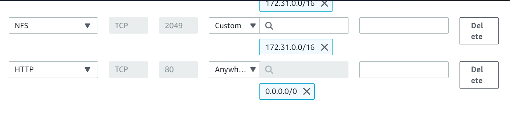

If you encounter 403 Error – check permissions to your /var/www/html folder and also disable `SELinux sudo setenforce 0`
To make this change permanent – open following config file 

```bash
sudo vi /etc/sysconfig/selinux
```

and set **SELINUX=disabled,** then restart httpd;

```bash
sudo systemctl start httpd
sudo systemctl status httpd
```
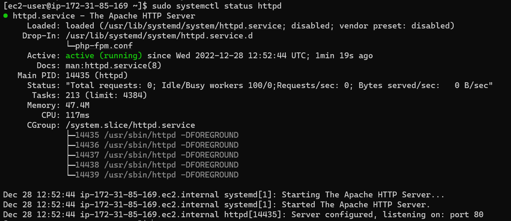

6. Update the website’s configuration to connect to the database (in **/var/www/html/functions.php** file).

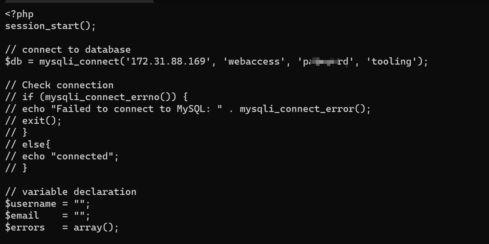
 
edit the database private ip address, database username and database name. save and quit

 7. Apply tooling-db.sql script to your database using this command
   
```bash
mysql -h <databse-private-ip> -u <db-username> -p <db-pasword> < tooling-db.sql
```

To do this, you have to follow the following steps:

- Install mysql on web server
  
```bash
sudo yum install mysql -y
```

- Open port 3306 on database server
  
!

- You'd also need to configure MySQL server to allow connections from remote hosts.
  
```bash
sudo vi /etc/mysql/mysql.conf.d/mysqld.cnf
```


- Restart mysql
  ```
  sudo systemctl restart mysql
  sudo systemctl status mysql
  ```
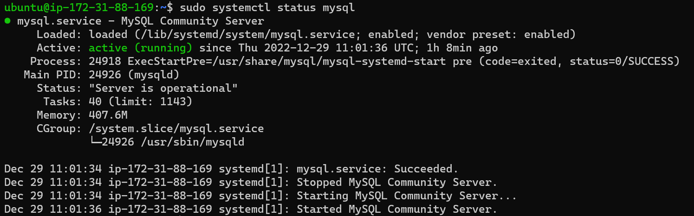

- From the webserver, apply tooling-db.sql script to your database 

```bash
mysql -h <databse-private-ip> -u <db-username> -p <dbname> < tooling-db.sql
```

8. If it returns no error, create in MySQL a new admin user with username: myuser 
 
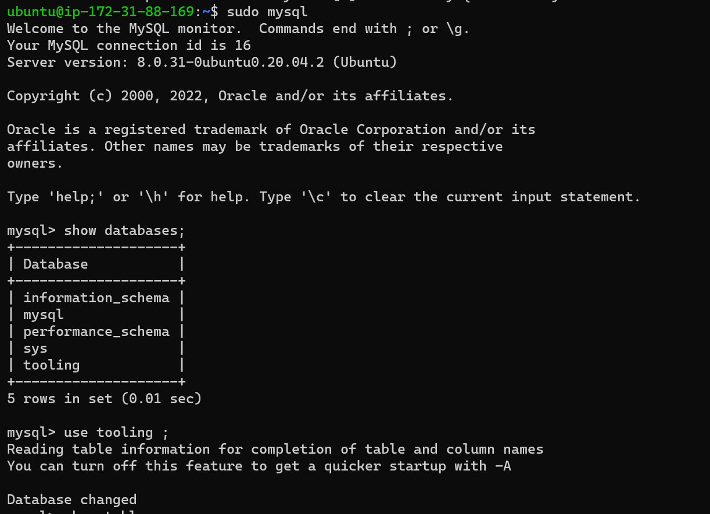
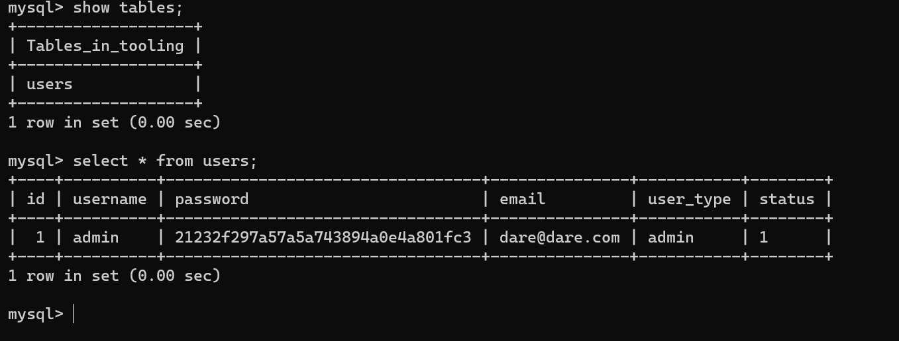

9. Open the website in your browser http://Web-Server-Public-IP-Address-or-Public-DNS-Name/index.php and make sure you can login into the website with myuser user.
    
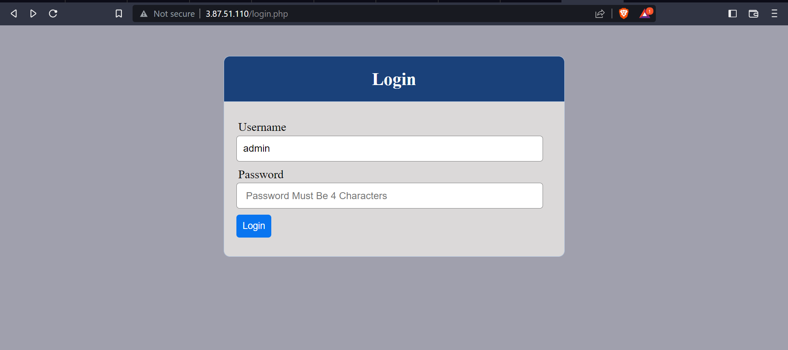

 I will be logging in using user name "admin" and corresponding password

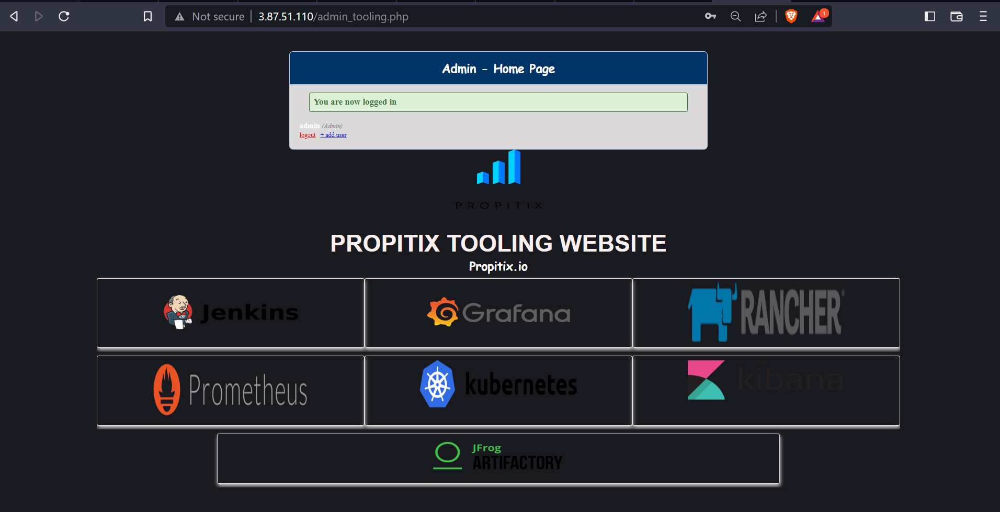

### Congratulations!


**You have just implemented a web solution for a DevOps team using LAMP stack with remote Database and NFS servers.**


new 